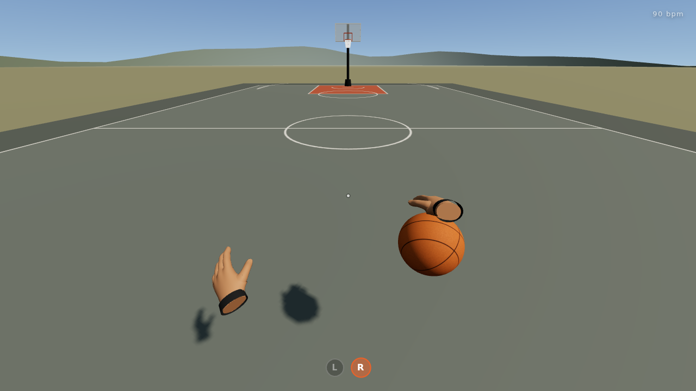

# 🏀 Home Court

A first-person basketball game built with **Three.js** and **Rapier**, being
built one mastered system at a time. Stage one was the handle: an open
outdoor court, VR-style hands (no arms, no legs), a real basketball, and a
dribbling engine whose whole job is to make the ball feel like it is on a
string. Stage two is the jumper: a 2K-style shot meter, a continuous
gather-set-release out of any dribble, an arc solved to land exactly where
the timing says it should, a physics net, and a swish you can hear.



---

## Play

```bash
npm install
npm run dev
```

Open the printed URL, click **Step on the court**, and click again to capture
the mouse. Look at the ball to catch it.

### Play it in your browser

**https://timmascara.github.io/knox-game-idea/**

Published from `main` on every push. Use that link rather than an embedded
preview: a full page can capture the mouse, and embedded frames refuse to.

### Hosting setup

`.github/workflows/pages.yml` deploys a playable build to GitHub Pages. Two
settings are needed, both one-time:

1. **Settings → Pages → Source: GitHub Actions**
2. **Settings → General → Default branch**: set it to `main`

The second one matters because the `github-pages` environment only lets the
repo's *default* branch deploy. Once both are set, every push to `main`
publishes to `https://<owner>.github.io/<repo>/`.

Use the hosted page rather than an embedded preview: a full page can capture
the mouse, and embedded frames refuse to.

### Controls

| Input | Action |
| --- | --- |
| `W A S D` | Move · `Shift` sprint (speed dribble, ball pushed out ahead) |
| Mouse | Look (the ball stays in front of your *body*, not your head) |
| **`K` (hold)** | **Shoot** — let go in the green |
| **`J`** | **Jump** — with the ball near the rim: the layup takeoff, then tap `K` to release |
| `E` | Pick up the ball · hold ↔ dribble |
| **Left click** | Crossover · with `S` held: **step-back** |
| **Right click** | Between the legs |
| `Q` | Behind the back |
| `F` | In & out |
| `R` | Hesitation (hang dribble, then explode) |
| `C` (hold) | Low / protect dribble |
| `G` | Drop the ball |
| `Tab` | Live tuning panel |
| `Esc` | Pause / settings / **controls (rebind anything)** |

From a hold, **left click** starts dribbling in the right hand and **right
click** in the left. Moves can be pressed ahead of time: a two-deep buffer
chains them at the next catch, so *click, Q* is a crossover into a behind-
the-back, and a pound can be interrupted early in its carry for snappier
response.

Hold the shoot button from a hold or straight out of a dribble and the
ball gathers into both hands, sets beside your eye and rises with a hop
while the meter beside the crosshair fills. Let go in the tiny green band
and it swishes; just outside and it catches back iron and pops out;
further and it comes off the glass; further still and it is an airball.
Inside about two and a half metres of the rim, `J` with the ball is a
layup: you leap at the basket, the ball is scooped up your shooting side,
and a tap of `K` lets it go at the rim — tap early and it waits for the
top of the jump. With nobody guarding you it goes in every time, off the
glass: the bank is solved exactly (glass restitution, the friction that
takes 2/7 of the tangential speed, the drop through the rim centre), so it
kisses the board and falls through from any angle. If you never tap you
come down holding the ball. Every zone is deterministic.
The body squares up to the basket by itself and keeps its momentum; your
head stays free. A made shot drops out of the net and settles under the
rim. Every key above can be rebound from the pause menu.

Working on this project? Read **[CLAUDE.md](CLAUDE.md)** first — it records
the invariants, the conventions, what is deliberately absent, and what the
next stage needs.

---

## How the dribble works

A dribble is not a sine wave. It is a repeating cycle with two very different
halves, and the engine models both:

1. **Contact** (ball in hand, ~0.15 s for a pound). The ball is caught still
   rising, rides up a few centimetres as the hand absorbs it, then is pushed
   down and out. This is a piecewise cubic Hermite path through a few
   waypoints in the *handle frame* (a body-relative space that trails the feet
   and your look direction with a little lag, so the ball has weight).
   Every move is just a different set of waypoints — carried across the body
   for a crossover, wrapped around the hip for a behind-the-back, rolled
   inward and back out for an in-and-out — plus which hand receives it.

2. **Flight** (ball out of the hand). A real ballistic solve: the release
   velocity is *derived* from where the hand wants the ball back and how high,
   the ball drops, hits the court with vertical restitution and a little
   horizontal loss, and rises into the catch point still moving up ~0.9 m/s
   so the hand meets a rising ball. Cadence is not a tuning number — it falls
   out of the physics (hip-high pound ≈ 85 bpm, knee-high ≈ 120 bpm).

Position **and velocity** are continuous through the whole cycle: the
contact path starts with the flight's arrival velocity and ends with the next
flight's release velocity. Nothing ever snaps.

The hands are choreographed around that cycle: the carrying palm tracks the
ball exactly, follows through after the release, drops with the ball, then
rises ahead of it and descends to meet it at the catch. The other hand
guards, or — when a move switches hands — moves early to hover over where the
ball will arrive. Each move also sways the camera a few centimetres (the body
shifting into the move), which sells it in first person.

## How the shot works

The jumper is one continuous hand path in the same body-relative frame the
dribble uses: from wherever the ball is (mid-carry, mid-bounce, or held) to
a set point beside the eye, up to a load point above the forehead, and out
along the launch direction in a constant-acceleration extension whose end
velocity *is* the launch that swishes. Position and velocity never snap,
exactly like a dribble catch. The hop is timed so its apex lands on the
ideal release.

Letting go of the button grades the timing into a zone and replans a short
wrist-flick from the ball's current state to the launch that zone's aim
point needs — rim centre for a swish, just past the back tube for back
iron, high on the far side of the glass for a bank miss, short and low for
an airball — then re-solves the launch from the ball's actual position and
hands it to the physics engine with backspin. The solver is closed-form,
includes the ball's air damping, and lands within millimetres, so a green
really is a swish from anywhere on the court; the rim, the glass and the
floor decide the rest.

After release a tracker watches the flight: rim and board contacts come
from the physics engine, a make is confirmed only once the ball has
descended through the rim plane inside the hoop and is clearly below it,
and the HUD calls it — SWISH, BUCKET, BACK IRON, OFF THE GLASS, AIRBALL.

The net is a verlet cloth rendered as real cord geometry. The ball pushes
its cords apart and drags it down on the way through, the net slows the
ball a little (that drag is much of what makes a swish read as a swish),
whips back and swings. The swish sound is synthesised from that contact:
a cord brush, a lower whoosh from the net body, a few cord snaps.

### Project layout

```
src/
  core/         Constants (all the feel numbers) · MathUtils · Input · Game (fixed-step loop)
  physics/      Physics — thin Rapier world wrapper
  player/       Player (kinematic capsule) · CameraRig (look + body sway) · HandModel (rigged hand) · Hands (the pair, world-space)
  ball/         Basketball (procedural 8-panel ball) · BounceMath (Flight solver + Hermite Contact)
                Moves (the move library, one cycle plan each) · DribbleController (possession, cycle, buffer, the jumper, hands, sway)
                Shot (arc solver, timing zones, outcome aim points, make/miss tracker)
  world/        World (open court, sun, horizon) · Court · Hoop · Net (verlet cord mesh) · Sky
  audio/        AudioManager — synthesised bounce / catch / rim / glass / swish / squeak / footsteps / wind
  ui/           HUD · ShotMeter · Menu · Tuning · styles
  state/        Settings (localStorage)
scripts/        smoke.mjs (headless test) · capture.mjs (contact sheets of any move or the shot) · shots.mjs (shot lab)
```

### The hands and the ball

- **Hands** are a sculpted hand mesh (`src/assets/hand_right.glb`, ~100k
  triangles, forearm cut under a sweatband) that arrived unrigged.
  `scripts/rig_hand.py` rigs it from the geometry alone: it traces the four
  fingers through cross-sections, places knuckle / middle / tip joints by
  arc length, finds the thumb lobe, skins every vertex to the nearest bone
  with a blend across each joint, and writes a skinned GLB whose joint
  frames put -Z down the bone and +Y toward the back of the hand. In the
  game, poses are four scalars (per-finger curl, spread, thumb curl, thumb
  abduction) on top of the sculpt's relaxed pose, damped toward named
  poses (`relaxed`, `open`, `ball`, `grip`, `guard`). The left hand is the
  right hand mirrored. They live in world space, attached to the body —
  turning your head never drags them with it.
- **The ball**'s colour, bump and roughness maps are painted per texel from
  the real seam geometry: an equator, a meridian, and two side circles of
  55° angular radius, which is exactly what produces a basketball's eight
  panels. Pebble grain is hashed value noise stretched to stay isotropic.

---

## Build & test

```bash
npm run build
npm run preview
npm run test:smoke
node scripts/capture.mjs all
node scripts/capture.mjs poses
ZONE=green node scripts/shots.mjs
```

In order: build the production bundle to `dist/`; serve that build on
http://127.0.0.1:4173; run the headless test (boots, dribbles, shoots,
checks the invariants); write contact sheets of every move and the shot to
`screenshots/`; the same for the rigged hand in every pose; and the shot
lab, which fires one timing zone from many spots and reports what happened.
The last three need `npm run preview` already serving.

(The blocks here are deliberately free of `#` comments: macOS zsh passes
them to the command as arguments instead of ignoring them.)

To re-rig the hand from the source sculpt (e.g. after tweaking joint
placement): `python3 scripts/rig_hand.py <hand.obj> src/assets/hand_right.glb`
(needs `numpy`).

The smoke test pumps the fixed-step loop through pickup, a pound rhythm,
every move, sprinting, the low dribble, a buffered combo, a drop and
chase, five jumpers (a green from the hold, a green pull-up out of a
running dribble, a late, a very early and a slightly late release), four
banked layups off a drive (at once, at the top, late, from a sprint), a
no-tap landing, and a plain jump, and asserts: the
ball never dips under the court, its velocity is continuous across catch
and release and through the whole jumper, the palm stays on the ball while
carrying and shooting, every move hands off to the intended hand and
returns to a pound, each release lands in its zone, a made ball settles
under the rim, and nothing goes non-finite. `capture.mjs` renders deterministic 20-frame
contact sheets so a move can be reviewed frame by frame without a GPU.

---

## Tuning

`Tab` opens sliders over every number in `DRIBBLE` and the feel numbers in
`SHOT` (`src/core/Constants.js`): dribble heights, ball offsets,
restitution, catch rise speed, push depth, handle lag, per-move carry
times, sway amplitudes; the ideal release time, the timing windows, entry
angle, hop and backspin. Changes apply live and are not persisted — when
something feels right, write it into Constants.

## Sound

Every sound is synthesised in code, so the game is self-contained — but
those are placeholders. Drop a file into `src/assets/audio/` named after a
sound (`swish.wav`, `rim.wav`, `bounce-2.ogg` …) and the game plays it
instead, with no code change; add numbered files for several takes of the
same sound and it picks between them so repeated hits never phase. See
[`src/assets/audio/README.md`](src/assets/audio/README.md) for the list of
names. Sounds with no file keep their synth, so the folder can be filled one
sound at a time.

## Not here yet (on purpose)

Dunks, defenders, the park, weather and the scoreboard were removed (or
never built) to keep the early stages focused; the earlier build is in git
history (`bb515cf`).
A spin move is deliberately absent: a first-person spin with no body is
nauseating, and needs a camera treatment of its own.

## Tech

- [Three.js](https://threejs.org/) `0.169`
- [Rapier](https://rapier.rs/) (`@dimforge/rapier3d-compat` `0.14`)
- [Vite](https://vitejs.dev/) `5`

MIT licensed for the code. The court, ball, textures and audio are generated
in code; the hand mesh (`src/assets/hand_right.glb`) is a third-party sculpt
supplied by the project owner under its own licence.
